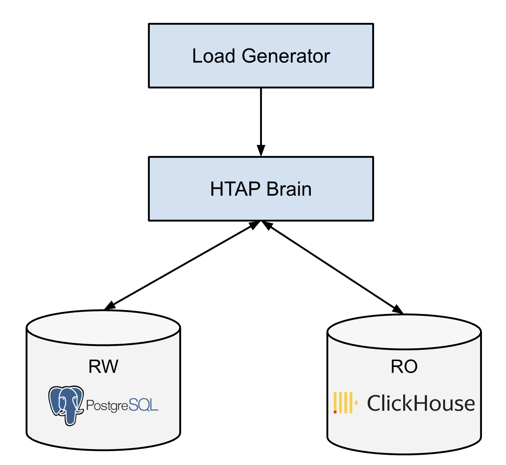

# HTAP Simulator

Project link: https://github.com/codesome/htap-simulator/



1) Install PostgreSQL and Clickhouse
   * PostgreSQL installation instructions: https://www.postgresql.org/download/
   * Clickhouse installation instructions: https://clickhouse.com/docs/en/install

2) Start PostgreSQL and Clickhouse servers on their default port. (PostgreSQL is queryable from port 5432 and Clickhouse is querable from port 9000)
 
3) Create a database named `htap` in both of them. For clickhouse, the database should be created under the `default` user.

4) Create the following tables

    In Postgres
    ```
    CREATE TABLE htap_table
    (
        id serial primary key,
        user_name VARCHAR(20),
        user_age INT,
        user_email VARCHAR(50),
        user_city VARCHAR(20),
        user_country VARCHAR(20),
        registration_date VARCHAR(20),
        is_active BOOLEAN,
        user_interest VARCHAR(20),
        visit_count INT,
        user_category VARCHAR(20)
    )
    ```

   In Clickhouse
    ```
    CREATE TABLE htap_table
    (
        user_name String,
        user_age UInt8
    )
    engine=MergeTree
    ORDER BY user_age
    ```

5) Install the `go` compiler if you do not already have it (https://go.dev/doc/install).

6) Start the htap-simulator

    ```bash
    $ go run htap-brain/*
    # Optional. If you get any error for above saying packages are not vendored,
    # run the below command to fetch the dependencies and start htap-brain again.
    $ $ go mod vendor
    ```

7) Start the read and write load in separate terminals

    For now, the read-load only produces OLAP queries. `load-generator/read.py` has instructions to change it to produce OLTP queries as well (a single line edit, search for `TODO` in that file).

    ```bash
    $ python3 load-generator/read.py
    ```

    ```bash
    $ python3 load-generator/write.py
    ```
